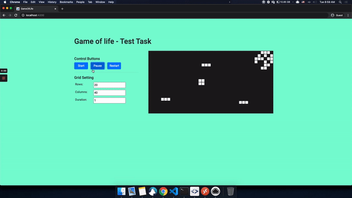

# Game Of Life

Game Of Life Angular 10

[DEMO](https://gameoflife-angular10.netlify.app/)

---

## 1. Requirements

For development, you will only need Node.js and a node global package, Yarn, installed in your environement.
And also need to install Angular CLI on your computer.

### 1) Node.js installation

#### Node installation on Windows

  Just go on [official Node.js website](https://nodejs.org/) and download the installer.
  Also, be sure to have `git` available in your PATH, `npm` might need it (You can find git [here](https://git-scm.com/)).

#### Node installation on Ubuntu

  You can install nodejs and npm easily with apt install, just run the following commands.

      $ sudo apt install nodejs
      $ sudo apt install npm

#### Other Operating Systems

  You can find more information about the installation on the [official Node.js website](https://nodejs.org/) and the [official NPM website](https://npmjs.org/).

    If the installation was successful, you should be able to run the following command.
    
        $ node --version
        v8.11.3

        $ npm --version
        6.1.0

    If you need to update `npm`, you can make it using `npm`! Cool right? After running the following command, just open again the command line and be happy.

        $ npm install npm -g

### 2) Yarn installation

After installing node, this project will need yarn too, so just run the following command.

      $ npm install -g yarn

### 3) Angular CLI installation

After installing node, this project will need yarn too, so just run the following command.

      $ npm install -g @angular/cli
      $ ng --version
        Angular CLI: 10.1.7
        Node: 12.18.3

---

## 2. How to install devDependencies

    $ git clone https://github.com/jsdev63/game-of-life.git
    $ cd game-of-life.git
    $ npm install

## 3. Running the project

    $ yarn start
    Go to https://localhost:4200

## 4. Build for production

    $ npm run build

## 4. TEST

    $ npm run test

